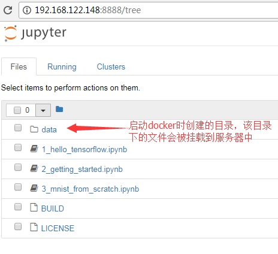
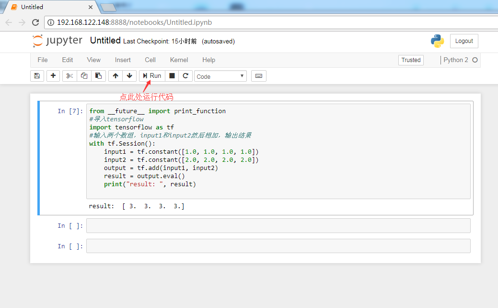

## tensorflow实践

启动tensorflow：

	#此镜像为官方镜像 tensorflow/tensorflow,2017-12-06号下载
	docker pull registry.cn-hangzhou.aliyuncs.com/zhg_docker_ali_r/tensorflow
	docker run -it -p 8888:8888 registry.cn-hangzhou.aliyuncs.com/zhg_docker_ali_r/tensorflow

	[root@localhost ~]# docker run -it -p 8888:8888 registry.cn-hangzhou.aliyuncs.com/zhg_docker_ali_r/tensorflow
	[I 10:51:13.574 NotebookApp] Writing notebook server cookie secret to /root/.local/share/jupyter/runtime/notebook_cookie_secret
	[W 10:51:13.834 NotebookApp] WARNING: The notebook server is listening on all IP addresses and not using encryption. This is not recommended.
	[I 10:51:13.889 NotebookApp] Serving notebooks from local directory: /notebooks
	[I 10:51:13.890 NotebookApp] 0 active kernels
	[I 10:51:13.890 NotebookApp] The Jupyter Notebook is running at:
	[I 10:51:13.890 NotebookApp] http://[all ip addresses on your system]:8888/?token=aaca35cf8caeae0370b2555d21b6cc390cb74ae908b3e705
	[I 10:51:13.890 NotebookApp] Use Control-C to stop this server and shut down all kernels (twice to skip confirmation).
	[C 10:51:13.891 NotebookApp] 
	    
	    Copy/paste this URL into your browser when you connect for the first time,
	    to login with a token:
	        http://localhost:8888/?token=aaca35cf8caeae0370b2555d21b6cc390cb74ae908b3e705
	[I 10:51:44.792 NotebookApp] 302 GET / (192.168.122.1) 1.96ms
	[I 10:51:44.800 NotebookApp] 302 GET /tree? (192.168.122.1) 1.28ms

浏览器浏览：

	http://192.168.122.148:8888

输入上面的token，进行登录,每次重启,token都会变化，可用<code>docker logs [容器id/容器名称]</code> 查看

### 后面发现需要用6006端口

	-it：将docker服务器执行的命令保留。
	--name：为这个容器命名。
	-p 8888:8888：在浏览器中使用localhost:8888可以访问到docker。
	-v ~/tensorflow:/notebooks/data：将~/tensorflow作为/notebooks/data的挂载点，方便文件的访问。

	-p  6006:6006：将容器内运行的TensorFlow可视化工具TensorBoard映射到本地机器，通过在浏览器中打开localhost:6006就可以将TensorFlow在训练时的状态、图片数据以及神经网络结构等信息全部展示出来。此镜像会将所有输出到/log目录底下的日志全部可视化。

使用：

	mkdir -p ~/tensorflow
	docker run -it -p 8888:8888 -p 6006:6006 -v ~/tensorflow:/notebooks/data --name tf registry.cn-hangzhou.aliyuncs.com/zhg_docker_ali_r/tensorflow 

之后在/notebooks/data目录下的文件会被保存在服务器上

### 新建一个python文件,python->new

	from __future__ import print_function
	#导入tensorflow
	import tensorflow as tf
	#输入两个数组，input1和input2然后相加，输出结果
	with tf.Session():
	    input1 = tf.constant([1.0, 1.0, 1.0, 1.0])
	    input2 = tf.constant([2.0, 2.0, 2.0, 2.0])
	    output = tf.add(input1, input2)
	    result = output.eval()
	    print("result: ", result)

运行结果：

	result:  [ 3.  3.  3.  3.]

