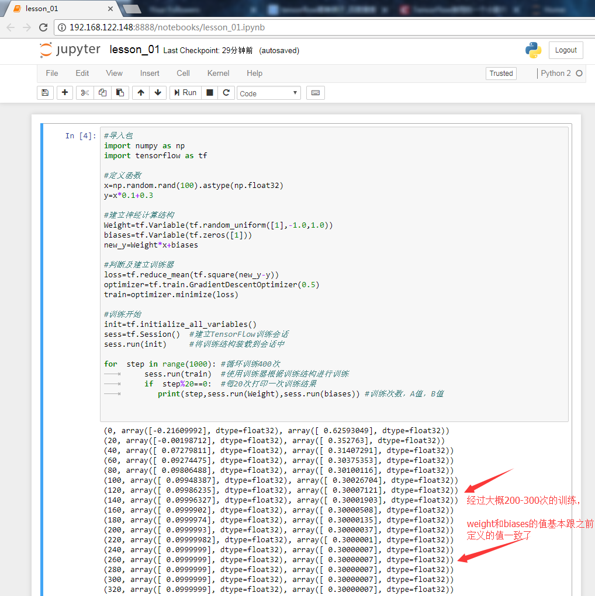

### 实践第一课
>有很多人可能会对机器学习感到害怕，但其实有好多原理我们现在不需要懂，我们先搞清楚TensorFlow有什么作用就行，那么下面我通过一个小的案例来说明TensorFlow是怎么使用的

### 原理说明（概率学中的逆概率）

    什么是逆概率
        我们肯定知道正概率，举个例子就是，箱子里有5个黑球5个白球，那你随机拿到黑球和白球的概率都是50%，那现在我不知道箱子里有多少个黑球白球，那我通过不断的拿球应该如何确定箱子里有多少个黑球白球呢，这就是出名的逆概率
        其实机器学习很多时候也就是逆概率的问题，我有大量现实例子的情况下，让机器从这些例子中找到共同的特征，例如给一万张猫的图片给机器学习，然后找到共同的特征（两只耳朵，四只脚，有胡须，有毛，有尾巴等特征）

    根据逆概率的概念我们再举个其他场景
        y=Ax+B（A、B是常量），这是一条非常简单的数学方程式，有小学基础的人应该都知道。
        我现在有很多的x和y值，所以问题就是如何通过这些x和y值来得到A和B的值？

### 代码

	#导入依赖库
	import numpy as np #这是Python的一种开源的数值计算扩展，非常强大
	import tensorflow as tf  #导入tensorflow 
	
	##构造数据##
	x_data=np.random.rand(100).astype(np.float32) #随机生成100个类型为float32的值
	y_data=x_data*0.1+0.3  #定义方程式y=x_data*A+B
	##-------##
	
	##建立TensorFlow神经计算结构##
	weight=tf.Variable(tf.random_uniform([1],-1.0,1.0)) 
	biases=tf.Variable(tf.zeros([1]))     
	y=Weight*x_data+biases
	##-------##
	
	
	loss=tf.reduce_mean(tf.square(y-y_data))  #判断与正确值的差距
	optimizer=tf.train.GradientDescentOptimizer(0.5) #根据差距进行反向传播修正参数
	train=optimizer.minimize(loss) #建立训练器
	
	init=tf.initialize_all_variables() #初始化TensorFlow训练结构
	sess=tf.Session()  #建立TensorFlow训练会话
	sess.run(init)     #将训练结构装载到会话中
	
	for  step in range(400): #循环训练400次
	     sess.run(train)  #使用训练器根据训练结构进行训练
	     if  step%20==0:  #每20次打印一次训练结果
	        print(step,sess.run(weight),sess.run(biases)) #训练次数，A值，B值

上面的代码，比较简单的能看懂，最后能手动敲一遍，别复制粘贴！！

