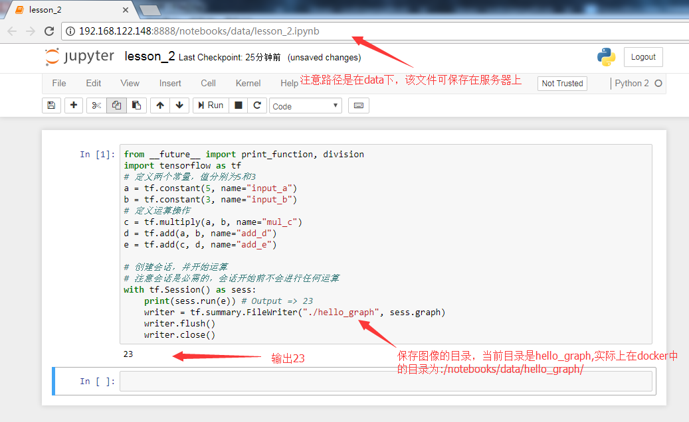
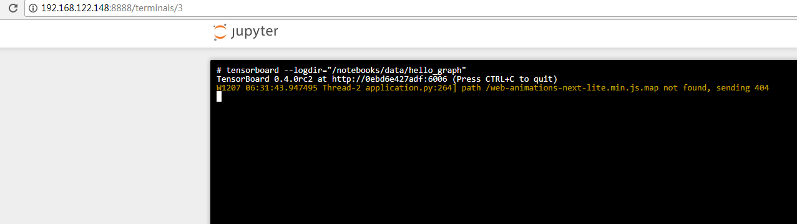
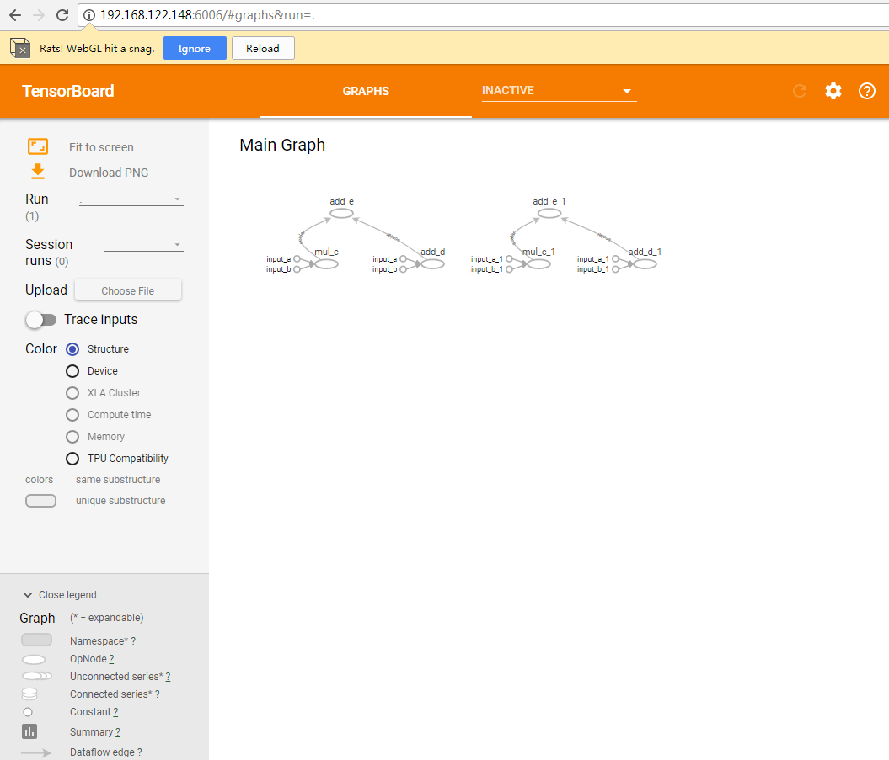

### 实践第2课

查看版本

引入tensorflow库并查看版本，确保已安装最新的稳定版（如1.2.0）。

	from __future__ import print_function, division
	import tensorflow as tf
	
	print('Loaded TF version', tf.__version__)
	# Output: Loaded TF version 1.4.0

为了兼容Python2和Python3的`print`和`division`函数，建议每个使用到的文件都引入`from __future__ import print_function, division`。

##### 简单示例

这个示例其实就是计算了(5*3)+(5+3)的结果

	from __future__ import print_function, division
	import tensorflow as tf

	# 定义两个常量，值分别为5和3
	a = tf.constant(5, name="input_a")
	b = tf.constant(3, name="input_b")
	# 定义运算操作
	c = tf.multiply(a, b, name="mul_c")
	d = tf.add(a, b, name="add_d")
	e = tf.add(c, d, name="add_e")
	
	# 创建会话，并开始运算
	# 注意会话是必需的，会话开始前不会进行任何运算
	with tf.Session() as sess:
	    print(sess.run(e)) # Output => 23
	    writer = tf.summary.FileWriter("./hello_graph", sess.graph)
	    writer.flush()
	    writer.close()

运行图：

接着，可以启动tensorboard来查看这个Graph（在jupyter notebookt中New->Terminals可以执行!tensorboard --logdir="hello_graph"）：

	tensorboard --logdir="/notebooks/data/hello_graph"  #设置log目录为/notebooks/data/hello_graph (容器内的目录),对应服务器上的目录为：/root/tensorflow/hello_graph

设置完成之后，浏览器打开http://192.168.122.148:6006即可看到图形：

