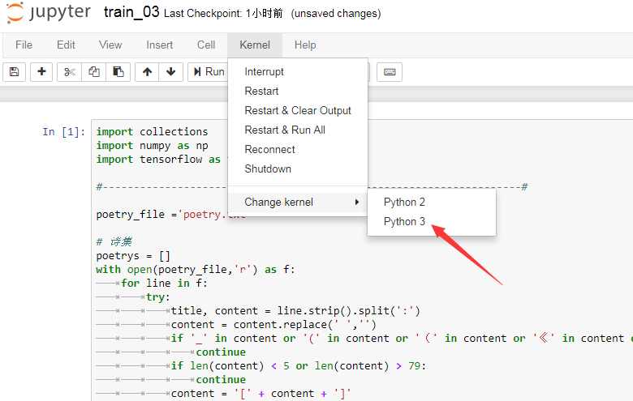

### 安装python3

>在jupyter notebook中，选择不同的python版本，叫做kernel（内核）。在进行安装时，安装 ipykernel即可。

由于jupyter里面含有的是Python 2,一些代码是用python3编写的，所以这里升级一下python版本

	docker exec -it tf /bin/bash
	apt-get update
	apt-get install python3-pip
	python3.5 -m pip install ipykernel
	pip3 install --upgrade pip
	python3.5 -m ipykernel install --user

升级包:

	pip install numpy
	pip install tensorflow

或者直接下载含有Python3的docker镜像

	tensorflow/tensorflow:latest-py3
