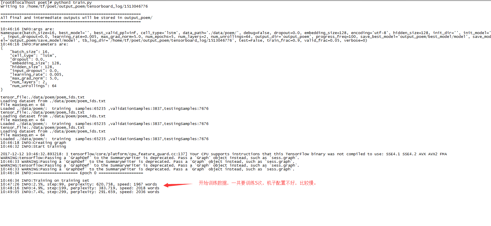
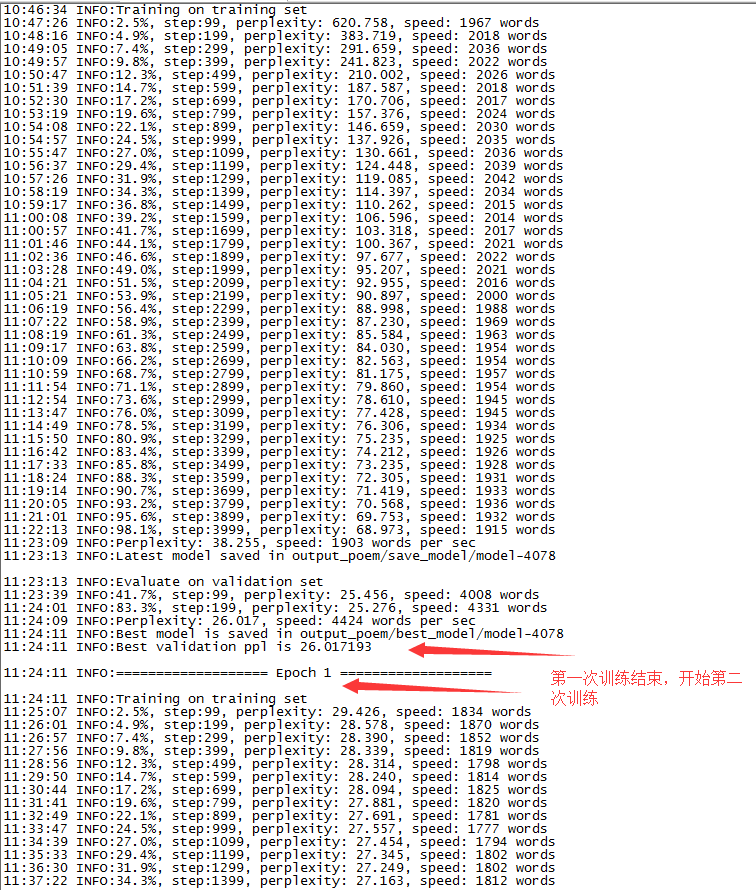
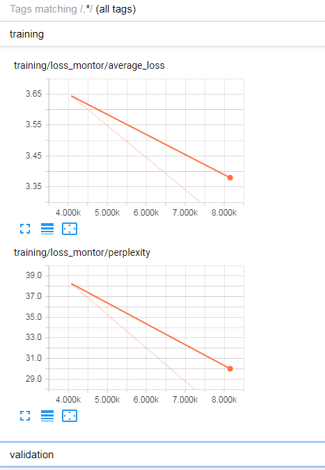
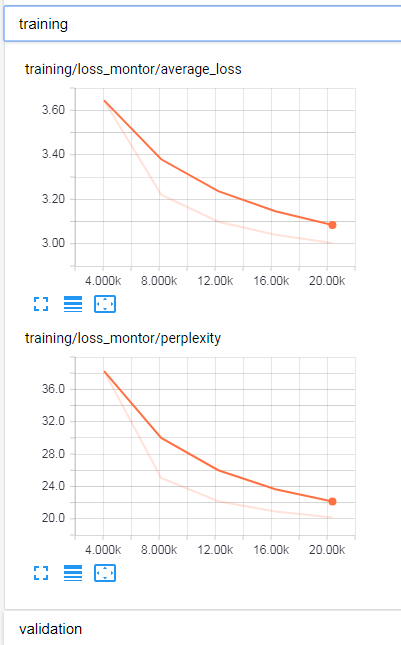
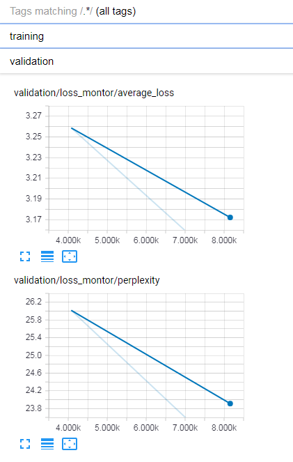
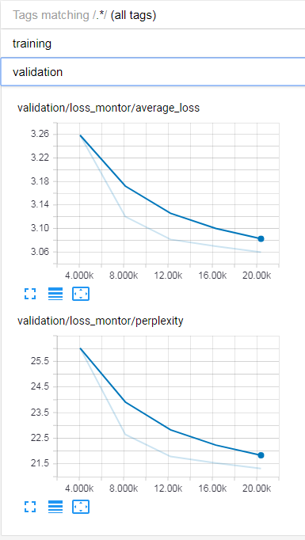

环境要求：
---
python:3.x   
tensorflow  1.x

 

运行训练：   
---

	python3 train.py

 
 
 
运行写诗服务
---
此步需要先运行训练产生好模型后。

	python3 poem_server.py

  

查看面板
---

	    tensorboard --logdir="/日志目录"  

浏览器访问：

		tensorboard --logdir="/home/tf/poet/output_poem/tensorboard_log"  
		http://192.168.122.148:6006

训练几次之后变成：

训练几次之后变成：

客户端用浏览器访问：  
---

自由诗：

	http://192.168.122.148:5000/poem?style=1
	管视龙龙苑，山津客圣晨。锦衔双露势，风照翠蛾峰。

押韵诗：

	http://192.168.122.148:5000/poem?style=2
	文师王更已，赋以喜亦邅。侧笔居远儿，趋宦共致君。

藏头诗，带押韵：

	http://192.168.122.148:5000/poem?style=3&start=邹慧刚
	邹川相见慕淮州，慧驾向山还想青。刚劳曼散茫明顾，不得青山不得情。

藏字诗，带押韵：

	http://192.168.122.148:5000/poem?style=4&start=静夜思
	夜静沧浪叟，筇帆自远行。猿思叶声润，岩锁恨乡乡。

